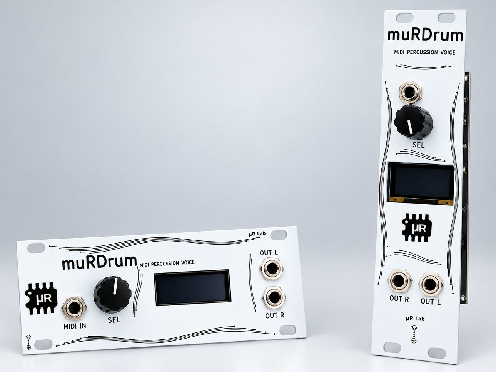

# muRDrum

*Formerly PicoDrum.*

<p align="center">
  
</p>

A polyphonic drum sample player for Eurorack, built around the Raspberry Pi
Pico 2. Eight slots, one-shot playback, MIDI in. No pitch, no envelopes, no
filters: it plays your samples, cleanly and on time.

Made by **muR Lab**. It comes in two formats with the same board and the same
firmware: **1U, 20HP** and **3U, 6HP**.

The module was called **PicoDrum** until October 2026. The first batch, the
**launch edition**, ships with the original PicoDrum panel; everything else,
board, firmware and features, is identical to a muRDrum. The same firmware
files run on both.

## Features

- **8 slots, 16 voices.** Each slot is monophonic with a 1 ms choke, the way a
  drum machine behaves, so the voice count is fixed and no hit ever gets
  stolen in normal playing
- **Up to about 83 seconds of samples in total, up to 200 samples**, stored in
  the Pico 2's own flash and organised in kits of eight. There is no SD card
- **Three kits included**: SYN_808, SYN_909 and SYN_DUST, synthesised from
  scratch after the classic machines and released under CC0 (see [`kits/`](kits/))
- **MIDI in** on a 3.5 mm TRS jack, Type A, listening on channel 10 by
  default, with slots on the General MIDI drum notes
- **Stereo out** with a **pan per slot**. At centre a slot sounds exactly as it
  would in mono
- **Velocity response** in four curves: OFF, LOW, MID, HIGH
- **8 user presets**, saved to flash with the settings
- One encoder and a small OLED. Every function is three gestures: turn,
  press, long press

## Loading your own samples

Use the sample loader on the muR Lab site, [murlab.it/loader](https://murlab.it/loader). It runs entirely
in the browser, so your samples are never uploaded anywhere. It builds the
library and writes it to the module over USB.

From the command line, `firmware/tools/convert_wav.py` builds the same
library file from a list of WAVs. See [`kits/README.md`](kits/README.md) for
a worked example.

## Firmware

Release UF2s are attached to each [GitHub release](../../releases). There are
four, and the names stay the same from one release to the next (they were
`murdrum_…` before the rename):

| File | Panel | Encoder |
|---|---|---|
| `murdrum_1U_enc-std.uf2` | 1U, 20HP, 0.91" display | standard |
| `murdrum_1U_enc-rev.uf2` | 1U, 20HP, 0.91" display | reversed |
| `murdrum_3U_enc-std.uf2` | 3U, 6HP, 0.96" display | standard |
| `murdrum_3U_enc-rev.uf2` | 3U, 6HP, 0.96" display | reversed |

`std` and `rev` match the S / R mark on the back of the panel. See
[`docs/FLASHING.md`](docs/FLASHING.md) for how to flash, and what to do if
the knob turns the wrong way.

### Building

You need the [Pico SDK](https://github.com/raspberrypi/pico-sdk) 2.2.0 and the
**official** [Arm GNU Toolchain](https://developer.arm.com/downloads/-/arm-gnu-toolchain-downloads)
(14.2 is what is tested). The Homebrew `arm-none-eabi-gcc` formula does not
work, because it ships without newlib.

```sh
cd firmware
PICO_SDK_PATH=/path/to/pico-sdk ./build.sh                 # 1U, standard encoder
PANEL=6HP ./build.sh                                       # 3U
ENC=REV ./build.sh                                         # reversed encoder
tools/build_all.sh                                         # all four release UF2s
```

`build.sh` looks for the toolchain in `~/pico/toolchain/`, or wherever
`PICO_TOOLCHAIN_PATH` points.

### Tests

The mixer, MIDI parser, encoder decoder, settings store and user interface
build natively on the host, with no hardware and no SDK:

```sh
cd firmware
tools/run_tests.sh
```

## Hardware

The board's schematic is in [`hardware/muRDrum_schematic.pdf`](hardware/muRDrum_schematic.pdf).
The main parts:

- Raspberry Pi Pico 2 (RP2350)
- PCM5102A stereo DAC over I2S, driven by the PIO
- H11L1 optocoupler on the MIDI input
- SSD1306 OLED: 128x32 on 1U, 128x64 on 3U
- EC11 rotary encoder with push switch
- Power from the Eurorack +12 V rail

The two outputs are plain jacks with no normalling. If you patch only one of
them, anything panned hard to the other side is silent.

## Repository layout

| Path | What it holds |
|---|---|
| `firmware/` | Firmware sources, host tests, and the build and library tools |
| `kits/` | The three bundled kits: source WAVs, the synthesiser that made them, and a ready-to-flash library |
| `hardware/` | The schematic |
| `docs/` | Flashing guide |

## License

- **Firmware and tools**: GNU General Public License, version 3 or (at your
  option) any later version (GPL-3.0-or-later), see [`LICENSE`](LICENSE)
- **Bundled kits** (`kits/`): CC0 1.0, see [`kits/LICENSE`](kits/LICENSE)
- **Schematic** (`hardware/`): CC BY-SA 4.0, see [`hardware/LICENSE`](hardware/LICENSE)
- The **muR Lab**, **muRDrum** and **PicoDrum** names and the muR Lab logo are not licensed
  under the GPL

Third-party code included here:

- `firmware/src/audio_i2s.pio` is derived from the `audio_i2s` program in
  [pico-extras](https://github.com/raspberrypi/pico-extras), © Raspberry Pi
  (Trading) Ltd, BSD-3-Clause
- `firmware/pico_sdk_import.cmake` is from the Pico SDK, © Raspberry Pi
  (Trading) Ltd, BSD-3-Clause

© 2026 muR Lab
